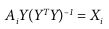
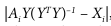

# MSE_BDA_2022

# But

Dans le cadre du cours de BIG DATA ANALYSIS (BDA), nous devons réaliser un projet d'analyse sur un dataset. Les outils utilisés seront Apache Spark et Scala. Nous avons choisi de réaliser un topique du livre Advanced Analytics with Spark de Oreilly.
Nous avons pris "**Recommending Music and the Audioscrobbler Data Set**". Il s'agit d'une analyse de collaborative filtering sur un dataset d'écoute de musique par utilisateurs. Dans le projet de base, les données sont traitées puis elles permettent d'entraîner un modèle ALS (Alternating Least Squares). Ce modèle permet de trouver des suggestions de contenu pour un utilisateur donné.

# Description du Dataset

Les données proviennent d'un ancien système de recommendation de musique appelé Audioscrobbler. Il était proposé par last.fm, un des premiers sites de streaing de music. L'idée était que les utilisateurs ajoutaient le plugin à leur lecteur. Celui-ci analyse les écoutes faites par les utilisateurs de la manière suivante:
Un utilisateur X à écouter l'artiste Y.
Ceci est très sommaire car nous n'avons pas d'autres informations sur la musique, le genre, etc...
Mais il a été très populaire car il pouvait être ajouter à des application tierce facilement.
Un point à noter est que les données étaient envoyées par l'utilisateur. C.à.d que chaque utilisateur X propose le nom de l'artiste Y. Donc un utilisateur peut orthographier un artiste de plusieurs façon par exemple: Metalica, Metallica, metalICA, etc... Il y a donc un travail de traitement des données.

Le Dataset audioscrobbler dispose de 3 fichiers contenant des données:

- artist_alias.txt

  Comme l'orthographes des artistes est parfois mal orthographié dans les données, un fichier qui lie les différentes orthographes à l'ID de l'artiste est disponibles. Ceci nous evite de devoir faire une rechercher de proximiter entre les nom des artistes.

- artist_data.txt

  Il s'agit du lien entre les noms des artistes (avec plusieurs orthographes) et un ID.

- user_artist_data.txt

  Ce fichier correspond au lien entre un utilisateur (catégorisé par un ID), un artiste et le nombre de fois qu'il l'a écouté.

## Description des features et du prétraitement

Voici la description des étapes réalisée pour obtenir un dataframe acceptable pour entrainer notre modèle. En effet les données de base ne sont pas forcément bien indexées. Par exemple, pour différencier les données par colonne, les fichier utilisent des tabulations mais certaines lignes n'ont pas de tabulation ou en ont trop.
Pour éviter donc les exceptions, Lors du mapping des données, à chaque ligne, une vérification est effectuée.

Ci-dessous est présenté un diagram présentant le prétraitement effectué ainsi que divers dataframe utilisé pour effectuer des tests (en vert).

D'abort 3 objects extrait des fichiers de base (un dataframe de ligne). Ces objects sont respectivement:

- userArtistDf: ce dataframe de test a permis de déterminer le nombre actuel d'utilisateur et d'artiste pour voir si il tenait sur un Int.
- artistAlias (Map): ce Map a permis de voir que le fichier row_artist_alias contient un nom d'artiste correctement ou mal orthographié mappé sur le nom d'artiste correct. par exemple si l'artiste 420 et mappé sur l'alias 420 alors on sait que celui-ci est le nom correct.
- artistByID (DF): Ce dataframe permet de filter par id le nom d'un artiste. Donc depuis un id de retrouver sont nom, il est utilisé pour retrouver le nom depuis une prédiction.

Pour obtenir le train dataset, il y a 2 étapes à effectuer. D'abort, le Map bartistAlias est créer, il fait la même chose que le Map artistAlias à l'exception qu'il est "broadcaster" (envoié à tout les noeuds de spark). Ensuite la fonction builCounts permet de créer le trainData en utilisant le fichier rawUserArtistData et bartistAlias. D'abort elle va pour chaque ligne, mapper l'id de l'utilisateur, l'id de l'artiste et le nombre d'écoute de l'utilisateur pour cet artiste. Une fois ceci fait il faut corriger l'artist id, en effet comme dit précédement certains artistes sont mal orthographiés et donc on un mauvais id.
L'on peut réaliser un **bArtistAlias.value.getOrElse(artistID, artistID)**, ceci permet de regarder si l'id de l'artiste est mappé sur quelque chose (un artiste id correctement orthographié) et donc de récupérer l'id correctement orthographié. Sinon si aucune valeur n'est récupérée, cela veut dire que l'id est déjà associé à un nom correctement orthographié et donc pas besoin de le changé.

Une fois tous ceci réalisé, nous obtenons un dataset d'entrainement.

## Description du projet de base

Le projet a donc pour but de réaliser des recommendation à partir du dataframe testdata. Pour ceci nous utilisons l'algorithme ALS. ALS est idéal car il permet de faire des recommendation pour n'importe quel type d'utilisateurs (ceux qui écoute beaucoup de musique et ceux qui n'en écoute peu).
Le type d'analyse est de type latent-factor c'est à dire qu'il permet d'observer l'interaction entre un large nombre d'utilisateur et un faible nombre d'observation.

Après avoir entrainer le model, la méthode de prédiction mise en place prend pour un utilisateur donné, le itemFactors (vecteur des artistes). Il va ensuite pour chaque artiste dans le vecteur, les ordonnés par prédiction et retourner les id.
Chaque id retourner sera transformer en nom à l'aide du dataframe artistByID. Une fois ceci réaliser, nous avons des recommendation personnalisée en fonction de l'utilisateur.

Pour évaluer la qualité de la recommendation, il faut trouver une métrique. Une façon de décrire la qualité, est de dire que les artistes les mieux recommendés ont les meilleures probabilités.
En comparant la somme de probabilités des meilleures recommendations avec celle des autres. On peut obtenir un ratio. Plus le ratio et élevé, plus les recommendation sont précises (seul les tops ont une probabilité élevée et le reste n'a pas de probabilité). Entre autre la qualité et évaluée en fonction de la saturation des recommentations.

## Description du Modèle

Le modèle ALS (Alternating Least Squares) est un algorithme de collaborative filtering basé sur le machine learning. Son principe de base est une sorte de factorisation de matrice Item/User. Imaginons notre matrice composée des interactions utilisateurs/artistes (item) ou celle-ci sont le nombre d'écoute réalisées par utilisateur pour chaque artiste. Cette matrice est très éparse car il y a énormément d'artiste différents. La force de ALS est, malgré que ces données soit éparpillées, il arrive à en ressortir une compréhension.

Comme le montre l'image ci-dessous ALS possède 2 matrices "factorisées" (user factor et item factor). Le principe d'ALS est de chercher à remplir ces matrices avec des données qui ont un sens. A la première itération de l'algorithme, l'une des matrices factorisées est remplie aléatoirement. A l'aide de l'algèbre matricelle ont peut déterminer les valeurs de la deuxième matrice factorisées:

Une fois ceci réaliser on peut chercher à minimisé l'erreur entre la factorisation et les données réels.: . Ensuite une fois les valeur de la matrice optimisée, les valeurs de la seconde matrice sont optimisée et ainsi de suite. D'ou le nom Alternating (l'alternance entre l'optimisation de la matrice X et Y).

Après un certains nombre d'epochs les 2 matrices sont une bonne factorisation de la matrice de base. Les 2 matrices factorisées permettent de ressortir des prédictions par utilisateur mais aussi par idem. Par exemple, une recommentation d'utilisateur par artiste.

# Questions supplémentaires
Dans le cadre du projet, Nous devons aussi résoudre des problématiques choisies par nous même. Nous avons choisi d'en ajouter 3 (une par membres du groupe).

## Market basket analysis

Dans le projet de base, l'algorithme utilisé (ALS) est un algorithme de collaborative filtering qui permet de répondre à la question "**Quels sont les artistes qu'un utilisateur, avec les mêmes goûts, aime ?**".

Alors qu'une autre question pourrait être posée : "**Quels sont les artistes qui apparaissent fréquemment ensemble ?**" Cette question peut être répondue avec une analyse du panier d'achat ou règle d'association. Notre intention est donc d'utiliser cet algorithme pour voir si effectivement, il permet de répondre à cette question.

### Algorithms you applied
### Optimisations you performed
### Your approach to testing and evaluation
### Results you obtained
### Possible future enhancements

## Clustering visualisation
​
Une autre question qu'il serait interressante de poser et "**Est-ce que des clusters apparaissent entre les artistes?**" ou "**Est-ce qu'on peut distinguer les genres musicaux avec simplement les données de base ?**". Pour prouver la veracité des résultats un 2ème dataset devra être utilisé pour vérifer les clusters.

### Algorithmes appliqués

Voici un exemple intérressant qui est très différent mais dont la méthode peut être utilisée pour faire du clustering. Dans le graphique ci-dessous, 3 vins décrit par des termes comme "bouchoné, sucré, fruité,..." sont placé sur une matrice vin/termes où si un vin a été décrit par ce termes une fois il aura la valeur 1. Ensuite l'algorithme de PCA est appliqué sur les features (les termes) cela permet de réduire la dimention et de voir si les vin sont plus ou moins éloigné gustativement (si il crée des clusters).

En faisant une analogie avec notre dataset, on peut réaliser une matrice des artistes (les vins) avec les utilisateurs (les termes) et ensuite réduire la dimentionnalité à l'aide de la pca.
Le nombre d'écoute peut être transcrit par le nombre de fois qu'un terme a été attribué à un vin.

Evidemment créer une telle matrice prendrait beaucoup trop de place (des millions fois des millions) par chance la librairie machine learning de spark dispose des SparseVector qui représente poru chaque artiste leur ligne d'utilisateur dans la matrice. Les sparsevectors utilise 2 choses un array des indices aux quels les valeurs doivent être placées et les valeurs.

Une remarque peut déjà être faite, c'est que la PCA n'est pas performente pour de grande réduction de dimentionnalité comme ici. Il faudrait prendre un algorithme comme TSNE ou UMAP par exemple. Mais il n'existe pas dans cet librairie.

### Optimisations

En réalisant la PCA, les résultats n'était pas très concluent. Effectivement la PCA a du mal avec les fortes dimentions. Dans une seconde approche, Word2vec a été utilisé ou la l'idée était de voir le vecteur des features (les utilisateurs) comme une phrase. Ainsi des artistes avec des phrases similaires serait plus prêt les un des autres en théorie.

### Approche de test et d'évaluation

Pour attester de la réalité des clusters, il faut un moyen pour savoir si les artistes dans un cluster correspondent à un genre musical. Nous pourrions regarder à la main et voir parmi le cluster si des artistes connus d'un genre spécifique sont proches. Par exemple Metallica et Slayer. Mais ceci est fastidieux et ne peut pas être totalement objectif. Une autre solution et de connaître directement le style de l'artiste. Le problème est que cette information n'est pas disponible dans le dataset de base. Par chance, un dataset contenant beaucoup d'information sur la musique est disponible au lien : http://millionsongdataset.com/ celui-ci dispose effectivement de l'information voulue. Mais un autre problème se pose, en effet, les données sont disponibles sur AWS. Par chance, une subset est téléchargeable sur http://millionsongdataset.com/pages/getting-dataset/#subset. Cependant 2 subsets doivent être utilisé. "**artist_term.csv**" provenant d'une base de données SQLite contenant ID_Artist/Style et "**unique_artist.txt**" contenant un mapping ID_Artist/Name.

Après avoir merger les 2 datsets (a l'aide d'un notebook jupyter et pandas), On nouveau fichier respectant le format des autres a été créer. Il s'agit de "**artist_style.txt**" contenant un mapping Name/Style.
Pour le joindre aux autres données, il faut utiliser le nom de l'artiste comme jointure. Par chance, une fois les noms des artistes du dataset audioscrobbler prétraités (les mauvais orthographes enlevé), il match parfaitement ceux du nouveau dataset.
Nous finissons par obtenir un dataframe contenant un id utilisateur, un id artiste, un nombre d'écoute pour cet artiste et un style pour cet artiste.

Grace à cette nouvelle colonne les assemptions peuvent être facilement vérifiées.

### Resultats

Voici les résultats obtenus pour les différentes expériences. En premier il s'agit simplement d'un affichage du nombre d'écoutes par style de genre metal. On peut constater que le nouveau dataset contient énormement de style différents. Aussi que beaucoup d'écoute sont du death metal.

Dans ce deuxième test, après avoir réalisé la PCA sur les utilisateur par artistes. On peut constater que l'algorithme a du mal à réduire les fortes dimentionnalités comme prédit. Ici les classes sont les noms des artistes. En premier lieu aucun cluster n'a pu être décelé, en effet black sabbath se trouvait proche d'artiste de rap par exemple.

PS: pour ces tests seuls les genres métal et rap ont été retenus.

Le test suivant est le même clustering mais avec les styles comme classe. La aussi des genres comme rap, rap français ce mélange souvent avec des style comme death metal par exemple. Soit il n'existe pas de cluster, soit les utilisateurs de audioscrobbler ne sont pas des élitistes et ils aiment une variété de styles différents.

Dans cette expérience, les utilisateurs ont été regroupés par style. pour voir si les styles rap et metal créent 2 clusters distincts. Ici aussi ont peut constater qu'il n'y a pas de cluster distincts mais on peut constater que le death metal est extrement séparer des autres styles. Peut être que les utilisateurs écoutant du death métal écoute seulement du death metal et en grande quantité.

Pour cette dernière expérience avec word2vec on peut constater que la réduction spaciale est bien meilleure. Cependant aucun cluster par style n'a pu être décelé.

### Amélioration futures

Il serait peut être interressant de fine tuner word2vec et aussi de tester avec UMAP par exemple qui est très bon pour représenter les cluster.

## Ratio torrent achat

Les données fournies par le dataset sont très limitées. Il serait intéressant d'extraire des features supplémentaires à partir d'un de données disponibles.
Le faite que les données de base sont mal orthographiées peut nous donner des informations. En effet, les utilisateurs d'audioscrobbler enregistrait leur propre musique donc il pouvait avoir plusieurs orthographes différentes pour le même artistes. Nous faisons l'assomption que dans une playlist d'un utilisateur, un artiste mal orthographié a sûrement été piraté, car sur une plateforme comme Itunes les artistes était correctement orthographié. En sachant cela, nous pouvons nous poser la question : "**Quelle est la proportion de piratage ?**"

### Algorithms you applied
Aucun algothime n'a du être utiliser pour cette partie. Il faut ici jongler avec les différents datasets et en extraire les données partinentes.
Il faut ici un peu d'habilité avec les commandes Spark et également une bonne vision d'ensemble.
### Optimisations you performed
Une première observation est de connaître pour chacun des artistes le nombre de fois qu'il a mal été orthographié. Ceci peut nous donner
une idée sur le nombre de fois qu'il a été illégalement téléchargé.

Une seconde étape est de connaitre le nombre d'utilisateur qui écoute chaque artiste. Ceci nous permettra de calculer un ratio
torrent/achat pour chaque artiste.

Dans l'interval un comptage total du nombre de mauvaises orthographes sur le nombre total d'apparition des artistes nous donne
un valeur symbolique de 1.216% de torrent par rapport aux musiques achetées.

### Your approach to testing and evaluation
Une "cross-validation" ratio/nombre de mauvaises orthographe/artiste a été réalisée. Cela démontre que les manipulations des dataframes
sont correctes mais qu'il y a des soucis dû aux datasets.

### Results you obtained

### Possible future enhancements
Il y a plusieurs points qui nous font dire que l'approche utilisée ici n'est pas fiable à 100%.
1. Il y a des valeurs manquantes dans les données, ce qui fausse les résultats (ex: ratio de 2.4)
2. Même si un artiste est bien orthographié, cela ne veut en aucun cas qu'il n'a pas été piraté

# Conclusion
