# MSE_BDA_2022

# But

Dans le cadre du cours de BIG DATA ANALYSIS (BDA), nous devons réaliser un projet d'analyse sur un dataset. Les outils utilisés seront Apache Spark et Scala. Nous avons choisi de réaliser un topique du livre Advanced Analytics with Spark de Oreilly.
Nous avons pris "**Recommending Music and the Audioscrobbler Data Set**". Il s'agit d'une analyse de collaborative filtering sur un dataset d'écoute de musique par utilisateurs. Dans le projet de base, les données sont traitées puis elles permettent d'entraîner un modèle ALS (Alternating Least Squares). Ce modèle permet de trouver des suggestions de contenu pour un utilisateur donné.

# Description du Dataset

Les données proviennent d'un ancien système de recommendation de musique appelé Audioscrobbler. Il était proposé par last.fm, un des premiers sites de streaing de music. L'idée était que les utilisateurs ajoutaient le plugin à leur lecteur. Celui-ci analyse les écoutes faites par les utilisateurs de la manière suivante:
Un utilisateur X à écouter l'artiste Y.
Ceci est très sommaire car nous n'avons pas d'autres informations sur la musique, le genre, etc...
Mais il a été très populaire car il pouvait être ajouter à des application tierce facilement.
Un point à noter est que les données étaient envoyées par l'utilisateur. C.à.d que chaque utilisateur X propose le nom de l'artiste Y. Donc un utilisateur peut orthographier un artiste de plusieurs façon par exemple: Metalica, Metallica, metalICA, etc... Il y a donc un travail de traitement des données.

Le Dataset audioscrobbler dispose de 3 fichiers contenant des données:

- artist_alias.txt

  Comme l'orthographes des artistes est parfois mal orthographié dans les données, un fichier qui lie les différentes orthographes à l'ID de l'artiste est disponibles. Ceci nous evite de devoir faire une rechercher de proximiter entre les nom des artistes.

- artist_data.txt

  Il s'agit du lien entre les noms des artistes (avec plusieurs orthographes) et un ID.

- user_artist_data.txt

  Ce fichier correspond au lien entre un utilisateur (catégorisé par un ID), un artiste et le nombre de fois qu'il l'a écouté.

## Description des features et du prétraitement

Voici la description des étapes réalisée pour obtenir un dataframe acceptable pour entrainer notre modèle. En effet les données de base ne sont pas forcément bien indexées. Par exemple, pour différencier les données par colonne, les fichier utilisent des tabulations mais certaines lignes n'ont pas de tabulation ou en ont trop.
Pour éviter donc les exceptions, Lors du mapping des données, à chaque ligne, une vérification est effectuée.

Ci-dessous est présenté un diagram présentant le prétraitement effectué ainsi que divers dataframe utilisé pour effectuer des tests (en vert).

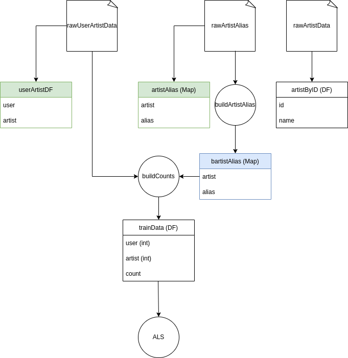

D'abort 3 objects extrait des fichiers de base (un dataframe de ligne). Ces objects sont respectivement:

- userArtistDf: ce dataframe de test a permis de déterminer le nombre actuel d'utilisateur et d'artiste pour voir si il tenait sur un Int.
- artistAlias (Map): ce Map a permis de voir que le fichier row_artist_alias contient un nom d'artiste correctement ou mal orthographié mappé sur le nom d'artiste correct. par exemple si l'artiste 420 et mappé sur l'alias 420 alors on sait que celui-ci est le nom correct.
- artistByID (DF): Ce dataframe permet de filter par id le nom d'un artiste. Donc depuis un id de retrouver sont nom, il est utilisé pour retrouver le nom depuis une prédiction.

Pour obtenir le train dataset, il y a 2 étapes à effectuer. D'abort, le Map bartistAlias est créer, il fait la même chose que le Map artistAlias à l'exception qu'il est "broadcaster" (envoié à tout les noeuds de spark). Ensuite la fonction builCounts permet de créer le trainData en utilisant le fichier rawUserArtistData et bartistAlias. D'abort elle va pour chaque ligne, mapper l'id de l'utilisateur, l'id de l'artiste et le nombre d'écoute de l'utilisateur pour cet artiste. Une fois ceci fait il faut corriger l'artist id, en effet comme dit précédement certains artistes sont mal orthographiés et donc on un mauvais id.
L'on peut réaliser un **bArtistAlias.value.getOrElse(artistID, artistID)**, ceci permet de regarder si l'id de l'artiste est mappé sur quelque chose (un artiste id correctement orthographié) et donc de récupérer l'id correctement orthographié. Sinon si aucune valeur n'est récupérée, cela veut dire que l'id est déjà associé à un nom correctement orthographié et donc pas besoin de le changé.

Une fois tous ceci réalisé, nous obtenons un dataset d'entrainement.

## Description du projet de base

## Description du Modèle

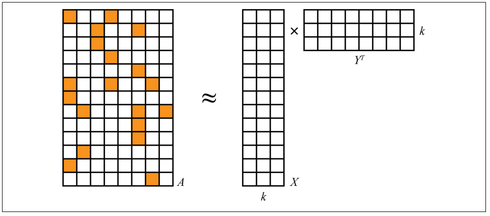

# Questions supplémentaires
Dans le cadre du projet, Nous devons aussi résoudre des problématiques choisies par nous même. Nous avons choisi d'en ajouter 3 (une par membres du groupe).

## Market basket analysis

Dans le projet de base, l'algorithme utilisé (ALS) est un algorithme de collaborative filtering qui permet de répondre à la question "**Quels sont les artistes qu'un utilisateur, avec les mêmes goûts, aime ?**".

Alors qu'une autre question pourrait être posée : "**Quels sont les artistes qui apparaissent fréquemment ensemble ?**" Cette question peut être répondue avec une analyse du panier d'achat ou règle d'association. Notre intention est donc d'utiliser cet algorithme pour voir si effectivement, il permet de répondre à cette question.

### Algorithme appliqué

L'algorithme utilisé pour effectuer une analyse du panier d'achat est FPGrowth. FPGrowth est un des algorithmes qui permet de créer des règles d'association. Ces règles associes un ou plusieurs objets à un autre objets. Dans notre example, une règle implique que si nous écoutons un certain ensemble d'article alors on aimera écouté un autre artiste. Chaque règle contient des valeur qui montre sa sureté, la "confidence", le "support" et le "lift".

- Le "confidence" (ou confiance) est la probabilité que l'objet A soit présent dans une règle si l'objet B y est. Plus cette valeur est élevé plus nous pouvons avoir confiance en la règle.
- Le "support" est la probabilité que l'objet A (résultat d'une règle) apparaisse. Le support permet d'avoir une idée de la fréquence du l'objet.
- Le "lift" est le ratio entre la "confidence" et le "support".

### Transformation des données

La forme des données ne sont pas adaptée pour utiliser avec l'algorithme FPGrowth et effectuer une analyse du panier d'achat. Tou d'abord, il ne s'agit pas d'un panier d'achat, mais d'une list d'artiste écoutés par des utilisateur. Pour contourner se soucis, il est possible de regrouper tous les artiste qu'un utilisateur à écouté et considérer le résultat comme les objets dans sont panier d'achat.

Par example si on as cette liste:

- User 1: Coldplay
- User 2: U2
- User 3: Coldplay
- User 2: The Beatles
- User 3: Mika

Nous pouvons la transformer sous cette forme (chaque ligne est appelé un transaction):

- User 1: Coldplay
- User 2: U2, The Beatles
- User 4: Coldplay, Mika

### Approche de test et d'évaluation

Pour vérifier les résultats, nous avons tout d'abord examiné les valeurs des différents paramètres. Il est important d'avoir une confidence suffisamment élevé mais aussi un support élevé. Nous pouvons aussi regarder quelques règles et voir si elle font sens.

### Resultats

Il y un peu moins de 150000 transactions différentes ave une moyen de 165 artists par transaction (min:1, max 6836) Les données sont très éparpillées.

Environ 200 règles d'associations on été crées avec un support minimum de 0.1 et une confiance minimum de 0.2.

Le support le plus élevé est de ~0.15 alors que la confiance la plus élevée est de ~0.7.

Le résultat du support est plutôt faible et indique que les règle ne sont pas forcément très sure.

Un autre soucis est que les règles n'associe qu'un artiste à un autre ce qui ne les rendent pas très intéressante pour faire une recommendation de musique.

Voici quelques exemple de règles:

- The Offspring => Green Day
- Led Zeppelin => Red Hot Chili Peppers
- Bob Dylan => The Beatles

Les recommendation peuvent faire sens mais le problème est que le support est faible et que l'ensemble de départ a très peu d'éléments. Il y a des règles avec plusieurs artists dans l'ensemble de d'épart mais le support devient de plus en petit (moins de 0.1).

## Clustering visualisation

Une autre question qu'il serait interressante de poser et "**Est-ce que des clusters apparaissent entre les artistes?**" ou "**Est-ce qu'on peut distinguer les genres musicaux avec simplement les données de base ?**". Pour prouver la veracité des résultats un 2ème dataset devra être utilisé pour vérifer les clusters.

### Algorithmes appliqués

Voici un exemple intérressant qui est très différent mais dont la méthode peut être utilisée pour faire du clustering. Dans le graphique ci-dessous, 3 vins décrit par des termes comme "bouchoné, sucré, fruité,..." sont placé sur une matrice vin/termes où si un vin a été décrit par ce termes une fois il aura la valeur 1. Ensuite l'algorithme de PCA est appliqué sur les features (les termes) cela permet de réduire la dimention et de voir si les vin sont plus ou moins éloigné gustativement (si il crée des clusters).

En faisant une analogie avec notre dataset, on peut réaliser une matrice des artistes (les vins) avec les utilisateurs (les termes) et ensuite réduire la dimentionnalité à l'aide de la pca.
Le nombre d'écoute peut être transcrit par le nombre de fois qu'un terme a été attribué à un vin.

Evidemment créer une telle matrice prendrait beaucoup trop de place (des millions fois des millions) par chance la librairie machine learning de spark dispose des SparseVector qui représente poru chaque artiste leur ligne d'utilisateur dans la matrice. Les sparsevectors utilise 2 choses un array des indices aux quels les valeurs doivent être placées et les valeurs.

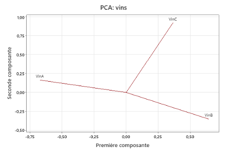

Une remarque peut déjà être faite, c'est que la PCA n'est pas performente pour de grande réduction de dimentionnalité comme ici. Il faudrait prendre un algorithme comme TSNE ou UMAP par exemple. Mais il n'existe pas dans cet librairie.

### Optimisations

En réalisant la PCA, les résultats n'était pas très concluent. Effectivement la PCA a du mal avec les fortes dimentions. Dans une seconde approche, Word2vec a été utilisé ou la l'idée était de voir le vecteur des features (les utilisateurs) comme une phrase. Ainsi des artistes avec des phrases similaires serait plus prêt les un des autres en théorie.

### Approche de test et d'évaluation

Pour attester de la réalité des clusters, il faut un moyen pour savoir si les artistes dans un cluster correspondent à un genre musical. Nous pourrions regarder à la main et voir parmi le cluster si des artistes connus d'un genre spécifique sont proches. Par exemple Metallica et Slayer. Mais ceci est fastidieux et ne peut pas être totalement objectif. Une autre solution et de connaître directement le style de l'artiste. Le problème est que cette information n'est pas disponible dans le dataset de base. Par chance, un dataset contenant beaucoup d'information sur la musique est disponible au lien : http://millionsongdataset.com/ celui-ci dispose effectivement de l'information voulue. Mais un autre problème se pose, en effet, les données sont disponibles sur AWS. Par chance, une subset est téléchargeable sur http://millionsongdataset.com/pages/getting-dataset/#subset. Cependant 2 subsets doivent être utilisé. "**artist_term.csv**" provenant d'une base de données SQLite contenant ID_Artist/Style et "**unique_artist.txt**" contenant un mapping ID_Artist/Name.

Après avoir merger les 2 datsets (a l'aide d'un notebook jupyter et pandas), On nouveau fichier respectant le format des autres a été créer. Il s'agit de "**artist_style.txt**" contenant un mapping Name/Style.
Pour le joindre aux autres données, il faut utiliser le nom de l'artiste comme jointure. Par chance, une fois les noms des artistes du dataset audioscrobbler prétraités (les mauvais orthographes enlevé), il match parfaitement ceux du nouveau dataset.
Nous finissons par obtenir un dataframe contenant un id utilisateur, un id artiste, un nombre d'écoute pour cet artiste et un style pour cet artiste.

Grace à cette nouvelle colonne les assemptions peuvent être facilement vérifiées.

### Resultats

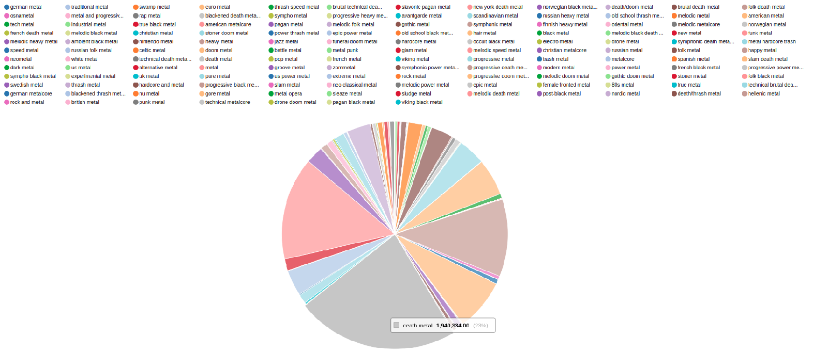

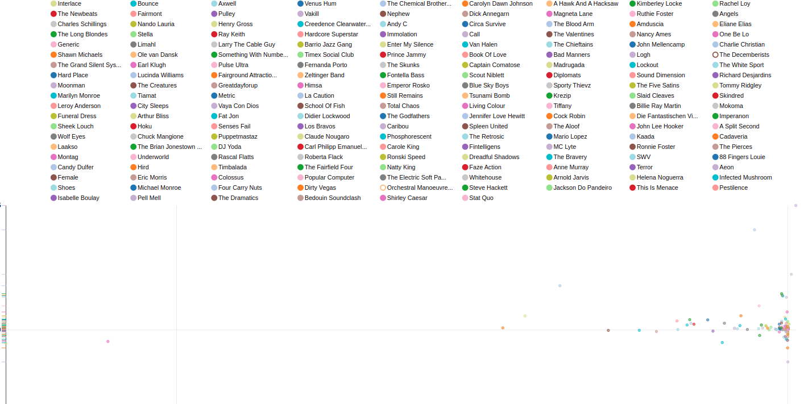

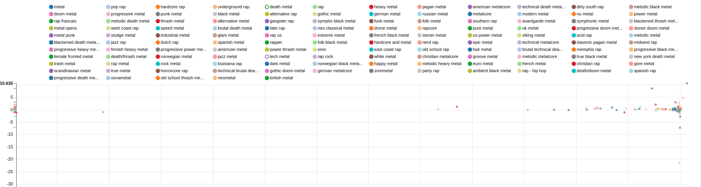

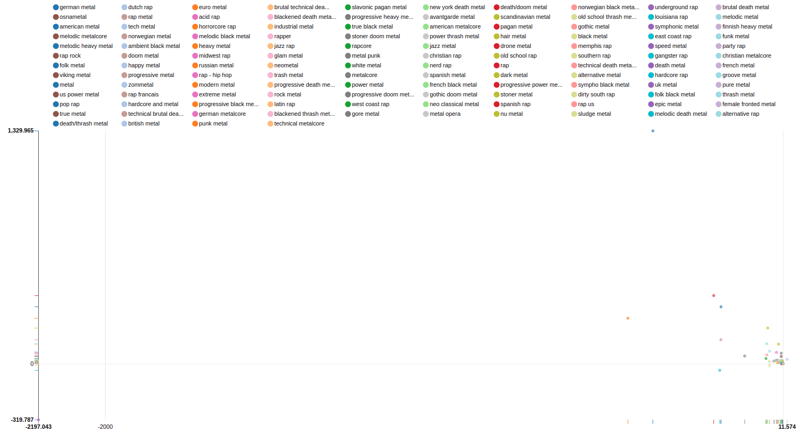

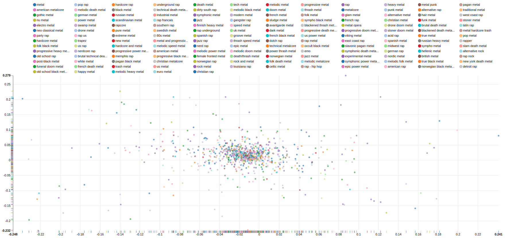

### Amélioration futures

## Ratio torrent achat

Les données fournies par le dataset sont très limitées. Il serait intéressant d'extraire des features supplémentaires à partir d'un de données disponibles.
Le faite que les données de base sont mal orthographiées peut nous donner des informations. En effet, les utilisateurs d'audioscrobbler enregistrait leur propre musique donc il pouvait avoir plusieurs orthographes différentes pour le même artistes. Nous faisons l'assomption que dans une playlist d'un utilisateur, un artiste mal orthographié a sûrement été piraté, car sur une plateforme comme Itunes les artistes étaient correctement orthographié. En sachant cela, nous pouvons nous poser la question : "**Quelle est la proportion de piratage ?**"

### Algorithme
Aucun algorithme n'a dû être utiliser pour cette partie. Il faut ici jongler avec les différents datasets et en extraire les données pertinentes.
Il faut ici un peu d'habilité avec les commandes Spark et également une bonne vision d'ensemble.

### Optimisations
Une première observation est de connaître pour chacun des artistes le nombre de fois qu'il a mal été orthographié. Ceci peut nous donner une idée sur le nombre de fois qu'il a été illégalement téléchargé. On part du principe que lors du piratage, du téléchargement illégal, l’utilisateur à mal orthographié le nom de l’artiste en l’enregistrant. Très souvent, aussi, les torrents étaient mal orthographiés, ce qui ne peut pas arriver lorsque l’utilisateur télécharge la music depuis un site légal par exemple iTunes. 
Nous créons un DaataFrame :

- Nombre de mauvaises ortographe / artiste : dans la liste des alias compter combien de fois un même artiste apparaît en goodid => misspelledCound, artistid
Avec l'artistid il est ensuite possible de retrouver les noms des artistes pour les afficher.

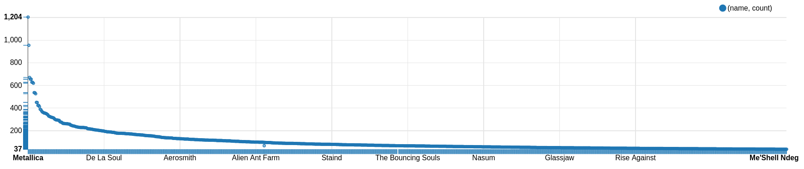

Sur l'image ci-dessus on peut voir que l'artiste "Metallica" est l'artiste qui à la plus souvent été mal orthographié. Dans une certaine mesure, cela signifie également qu'il est le plus téléchargé illégalement.
Cependant il est plus intéressant de connaitre le ratio "torrent/achat" pour l'artiste que la valeur absolue de torrent.

Une seconde étape consiste à connaitre le nombre de fois que chaque artiste apparait parmis les utilisateurs. Cette démarche permettra de calculer le ratio "torrent/achat" par artiste mais également le ratio total parmis tous les téléchargements d'artistes.

Nous créons un DataFrame : 
- Nombre d'apparition d'un artiste : transformation badid -> goodid, puis faire un compte sur les ids des artistes => apparitionArtisteCount, artistid, name

Nous commençons par calculer le ratio torrent/achat total. Nous obtenons un ratio de ~1.216% de torrent par rapport aux téléchargement légaux. 
Ensuite nous calculons pour chaque artiste sont propre ratio torrent/achat.
Selon si l'on trie le resultat par ordre ratio décroissant ou par artiste les plus mal orthographiés
nous pouvons mettre en évidence :
1. Dans l'ordre décroissant : il y a un souci avec l'extraction des données. Nous avons un ratio >1, ce qui ne peut pas être possible.
2. Les artistes les plus fréquemment mal orthographié n'ont pas forcément un ration élevé, car ils sont également largement écouté

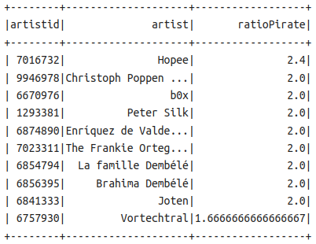

### Approche de test et d'évaluation
Une "cross-validation" ratio vs nombre de mauvaises orthographe vs artiste a été réalisée. Cela met en évidence
le problème rencontré auparavant, c'est-à-dire les ratios >1. Nous avons pour certain artistes un nombre de badid suppérieur à la somme total de fois, après modification de badid to goodid, que l'artiste apparait.

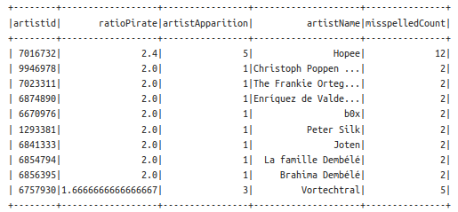

### Resultats
LEs résultats obtenus, pour le ratio torrent/achat par artiste sont les suivant :
1. Ratio des artistes le plus souvent mal orthographié :

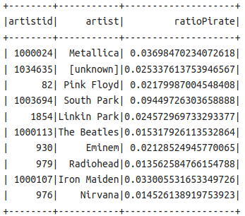

2. Graphique des ratios pour 1000 artistes :

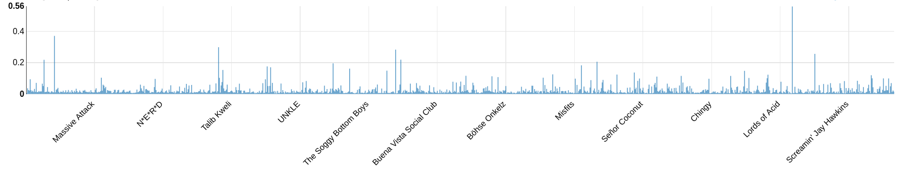

Dans l'ensemble, si l'on considère que les données sont consistentes pour les ratios les plus "faibles", il est peu fréquent qu'un artiste soit piraté par plus de 20% des gens.
Les artistes à fort taux d'écoute sont en moyenne piraté à 3%.

### Amélioration futures
Il y a plusieurs points qui nous font dire que l'approche utilisée ici n'est pas fiable à 100% :
1. Il y a des valeurs manquantes dans les données, ce qui fausse les résultats (ex: ratio de 2.4)
2. Même si un artiste est bien orthographié, cela ne veut en aucun cas qu'il n'a pas été piraté
3. Si un artiste à un nom compliqué, il a plus de chance d'être mal écrit lors du piratage qu'un nom simple.

Cette analyse bien qu'intéressante n'est donc pas concrète par la base de donnée qui a certain manquant et le fait que l'on ne peut jamais être certain si la mauvaise orthographe est dû à un piratage ou non. Un contre exemple de mauvaise écriture serait l'acquisition d'un CD puis le transfère des titres sur un mp3. Dans certain cas, les pc,
n'importaient pas le noms des artistes.

# Conclusion

